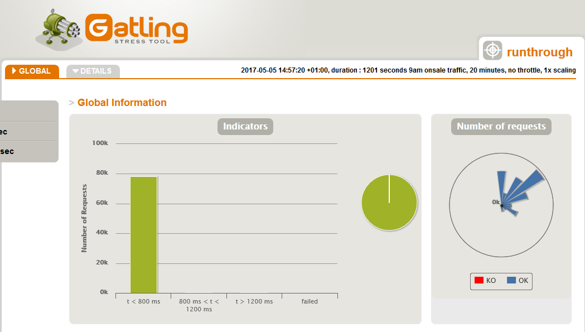
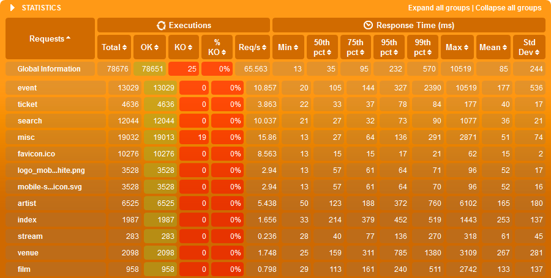
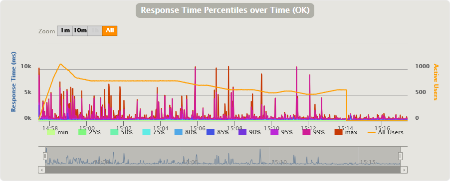
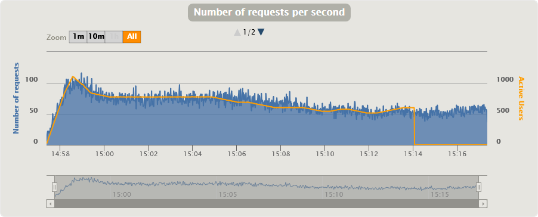

## Load Testing with Gatling


---

Doug Fitzmaurice - Ents24


---

## Motivation

Moving from this:

To this:

---

* How do we ensure stability?
* How many users can we handle?
* What is response time like under load?
* Have we missed any common packages?

---

## Gatling?

* Users, not URLs
* Tests written in Scala
* Actor model - high concurrency from one machine
* Great control over traffic levels
* Test recorder
* Visual result summaries

---

```

================================================================================
2017-05-07 12:49:45                                          25s elapsed
---- Requests ------------------------------------------------------------------
> Global                                                   (OK=702    KO=0     )
> ticket                                                   (OK=53     KO=0     )
> search                                                   (OK=50     KO=0     )
> event                                                    (OK=128    KO=0     )
> misc                                                     (OK=188    KO=0     )
> favicon.ico                                              (OK=147    KO=0     )
> mobile-search-icon.svg                                   (OK=40     KO=0     )
> logo_mobile-white.png                                    (OK=40     KO=0     )
> artist                                                   (OK=28     KO=0     )
> index                                                    (OK=5      KO=0     )
> stream                                                   (OK=6      KO=0     )
> venue                                                    (OK=15     KO=0     )
> film                                                     (OK=2      KO=0     )

---- Desktop Users -------------------------------------------------------------
[---                                                                       ]  0%
          waiting: 6424   / active: 236    / done:0
---- Mobile Users --------------------------------------------------------------
[---                                                                       ]  0%
          waiting: 3025   / active: 95     / done:0
================================================================================
```

---


---


---


---



---

```scala
atOnceUsers(20)
rampUsers(10) over(20 seconds)
```

---

```scala
val httpProtocol = http
    .baseURLs("https://www.ents24.com")
    .inferHtmlResources(WhiteList("""https://.*\.ents24\.com.*"""))
    .acceptHeader("text/html,application/xhtml+xml,application/xml;q=0.9,*/*;q=0.8")
    .acceptEncodingHeader("gzip, deflate, br")
    .acceptLanguageHeader("en-US,en;q=0.5")
    .disableFollowRedirect
    .userAgentHeader("Gatling Load Test")
    .hostNameAliases(Map("www.ents24.com" -> "52.212.206.40"))
```

---

```scala
val webAccessLog = csv("web-traffic.csv").circular
val web = scenario("Desktop Users")
      .repeat(6, "loops") {
        feed(webAccessLog)
        .exec(
          http("${Type}")
          .get("${Path}")
          .check(status.not(500))
        )
        .pause(40)
```

---

```scala
setUp(
  web.inject(
    constantUsersPerSec(3) during(120 seconds),
    constantUsersPerSec(2) during(600 seconds),
    constantUsersPerSec(3) during(120 seconds),
    constantUsersPerSec(2) during(120 seconds),
    constantUsersPerSec(3) during(120 seconds),
    constantUsersPerSec(2) during(120 seconds),
    constantUsersPerSec(3) during(1000 seconds)
  )
).maxDuration(20 minutes).protocols(httpProtocol)
```
---

## Log Replay

* Parse web server logs
* Produce CSV file of URLs
* Produce traffic profile:
    * How many users?
    * How many requests each?
    * How much gap between requests? 
    * How many arrive at once?
    * How many requests per second?
